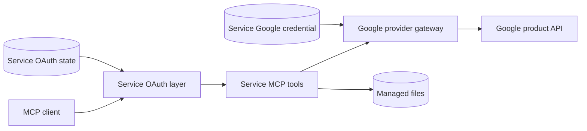

# Architecture Overview

Hawkx Workspace MCP provides five independent remote MCP services for Google Workspace:

- Gmail
- Google Calendar
- Google Drive
- Google Sheets
- Google Docs

Each service runs as a separate process with its own MCP endpoint, Google OAuth scopes, Google credential, downstream OAuth state, audit target, and managed-file boundary.

The services share transport and authorization libraries but do not share credentials or tool registries.

## Product Shape

| Service | Default port | Default MCP path | Service-base issuer | Canonical protected resource | Google product |
|---|---:|---|---|---|---|
| Gmail | `8431` | `/gmail/mcp` | `https://mcp.hawkxdev.dev/gmail` | `https://mcp.hawkxdev.dev/gmail/mcp` | Gmail API v1 |
| Calendar | `8432` | `/calendar/mcp` | `https://mcp.hawkxdev.dev/calendar` | `https://mcp.hawkxdev.dev/calendar/mcp` | Calendar API v3 |
| Drive | `8433` | `/drive/mcp` | `https://mcp.hawkxdev.dev/drive` | `https://mcp.hawkxdev.dev/drive/mcp` | Drive API v3 |
| Sheets | `8434` | `/sheets/mcp` | `https://mcp.hawkxdev.dev/sheets` | `https://mcp.hawkxdev.dev/sheets/mcp` | Sheets API v4 |
| Docs | `8435` | `/docs/mcp` | `https://mcp.hawkxdev.dev/docs` | `https://mcp.hawkxdev.dev/docs/mcp` | Docs API v1 |

Every process binds to loopback by default. A reverse proxy provides the public HTTPS surface.

## Request Flow

The same flow applies independently to all five services.



1. The MCP client discovers the service OAuth metadata through protected-resource metadata (`/.well-known/oauth-protected-resource/<service>/mcp`) and authorization-server metadata (`/.well-known/oauth-authorization-server/<service>`).
2. The client completes OAuth 2.1 authorization with PKCE S256.
3. The service validates the bearer token against its canonical protected resource (`/<service>/mcp`).
4. The authorization policy limits the tools and resources available to the client.
5. The selected MCP tool validates its input and calls the service provider gateway.
6. The gateway refreshes the service-specific Google credential when required.
7. The gateway calls the stable Google product API.
8. Provider responses are normalized into typed service schemas.
9. The tool returns a bounded, secret-free MCP result.

A Google credential never crosses the MCP boundary.

## Isolation Boundaries

| Boundary | Per-service state |
|---|---|
| Process | Independent application process |
| Network | Independent MCP path and default port |
| MCP surface | Independent tool registry |
| Client authorization | Independent OAuth state database, service-base issuer, and protected resource identifier |
| Google authorization | Independent scope set and refresh token |
| Audit | Independent audit target |
| Files | Independent managed download directory |
| Failures | Provider failures remain scoped to one service |

There is no shared master bearer token and no shared Google refresh token.

A credential issued for one Google service is rejected when another service requires a different scope set.

## Runtime Composition

A service process is assembled from four layers.

### Service configuration

`ServiceConfig` resolves the service-prefixed environment variables, default port, service-base public URL, MCP path, derived canonical resource URL, credential paths, proxy trust, OAuth lifetimes, and operational limits.

Configuration is immutable after startup.

### Service extension

Each service extension owns:

- its Google credential store;
- its provider gateway;
- its MCP tool registration;
- service-specific parsing and validation;
- optional managed-file or mutation helpers.

The extension cannot replace the shared OAuth, MCP, readiness, or health routes.

### Shared transport

The shared transport creates:

- the Streamable HTTP MCP application;
- OAuth metadata and endpoints;
- bearer authentication middleware;
- health and readiness routes;
- request authorization context;
- service audit logging;
- application lifespan management.

### Provider gateway

The provider gateway:

- loads and refreshes the service Google credential;
- creates the Google API client;
- applies bounded retries where the operation permits them;
- converts provider responses into typed schemas;
- translates provider and transport failures into safe service errors.

Tool handlers do not expose raw Google request mappings or raw provider responses.

## Endpoint Contract

Each service exposes the same endpoint classes under its own public URL.

| Endpoint | Access | Purpose |
|---|---|---|
| `GET /health` (proxied as `/<service>/health`) | Public | Process liveness |
| `GET /ready` (proxied as `/<service>/ready`) | Authenticated | Service readiness |
| `/<service>/mcp` | Authenticated | Streamable HTTP MCP (canonical protected resource) |
| `GET /.well-known/oauth-authorization-server/<service>` | Public | Authorization-server metadata (service-base issuer) |
| `GET /.well-known/oauth-protected-resource/<service>/mcp` | Public | Protected-resource metadata (canonical MCP resource) |
| `GET`, `POST /<service>/oauth/authorize` | OAuth flow | Owner login and authorization-code issuance |
| `POST /<service>/oauth/token` | OAuth flow | Authorization-code and refresh grants |
| `POST /<service>/oauth/register` | Public registration | Dynamic client registration |

The configured MCP path is service-specific. The default paths are listed in the Product Shape table.

The public URL must use HTTPS. Host validation and trusted proxy handling fail closed.

## Authorization Model

The system has two independent authorization layers.

### MCP client to service

The MCP client uses OAuth 2.1 with:

- PKCE S256;
- resource-bound bearer tokens;
- authorization-code grants;
- rotating refresh tokens;
- refresh-token replay detection;
- token-family revocation;
- dynamic client registration where supported.

A bearer token is accepted only for the exact canonical protected service resource (`/<service>/mcp`) that issued it.

### Service to Google

Each service uses a separate Google OAuth grant with the minimum required scopes.

The service:

- stores the Google credential in an owner-only file;
- refreshes the Google access token internally;
- rejects missing or incomplete scope grants;
- never returns Google tokens to the MCP client;
- never writes credential values to logs or tool results.

See [Google Cloud and OAuth Setup](google-cloud-setup.md) for API enablement, scopes, consent, publishing, verification, and credential provisioning.

## Configuration Boundaries

Every service reads variables with its uppercase service prefix:

```text
GMAIL_
CALENDAR_
DRIVE_
SHEETS_
DOCS_
```

The public URL is required and specifies the service-base issuer (`https://<host>/<service>`). The service derives the canonical protected resource URL (`https://<host>/<service>/mcp`), OAuth metadata routes, bearer-token resource binding, and advertised endpoints from that URL.

These paths must remain distinct:

- downstream OAuth state;
- Google credential;
- audit log;
- managed downloads.

The transport accepts an exact trusted-proxy allowlist. Wildcards and unbounded proxy networks are rejected.

Local development binds to loopback. A production public URL is advertised through the service configuration and served through an HTTPS reverse proxy.

## Service Capabilities

| Service | Capability groups |
|---|---|
| Gmail | bounded message and thread search, message and thread reads, labels, managed attachments, drafts, plain-text sending, replies |
| Calendar | calendar lists, bounded event search, event reads, free/busy, event CRUD, recurring events, mixed mutation batches |
| Drive | structured search, metadata, folder contents, managed downloads, exports, folders, uploads, versioned updates, moves, app-owned copies |
| Sheets | spreadsheet metadata, A1 range reads, range updates, row appends, range clearing, sheet creation, rename and copy |
| Docs | recursive tab metadata, bounded typed reads, document creation, text insertion, literal replacement, range deletion, atomic typed batches |

Detailed service arguments, limits, error schemas, and mutation semantics belong to the service integration reference rather than this overview.

## Credential Storage

The Google credential store enforces:

- owner-only credential directories;
- credential files with mode `0600`;
- no symbolic-link traversal;
- no collision with managed download paths;
- cross-process file locking;
- atomic credential writes;
- exact scope validation;
- secret-safe error messages.

A missing refresh token or incomplete grant is rejected without storing a credential.

## Managed Files

Gmail attachments and Drive downloads use a managed-file boundary.

Managed files use:

- validated file names;
- configured size limits;
- atomic publication;
- collision handling;
- SHA-256 metadata.

The Google credential path, OAuth state, backups, and audit logs cannot be placed inside the managed download directory.

## Failure Semantics

Provider failures are mapped to service-specific errors without exposing credential values or raw provider payloads.

Operations that may already have changed Google data are not blindly repeated after an uncertain result. The caller must reread the resource before deciding whether another mutation is safe.

A stale version, revision, or provider precondition produces a conflict instead of silently overwriting newer data.

## Process Lifecycle

Each service entry point:

1. loads and validates its immutable configuration;
2. creates the service extension and provider gateway;
3. opens the service OAuth state;
4. registers only the service-owned tools;
5. starts the Streamable HTTP application;
6. closes extensions and state in reverse order during shutdown.

Service commands:

```text
google-mcp-gmail
google-mcp-calendar
google-mcp-drive
google-mcp-sheets
google-mcp-docs
```

Google authorization, OAuth administration, and cutover safety use dedicated commands:

```text
google-mcp-authorize
google-mcp-oauth
google-mcp-cutover
```
## Source Layout

```text
src/google_workspace_mcp/
├── auth/
│   ├── bearer.py
│   ├── context.py
│   ├── oauth.py
│   └── state.py
├── audit/
│   └── logger.py
├── cli/
│   ├── authorize.py
│   ├── cutover.py
│   ├── oauth_admin.py
│   ├── runner.py
│   ├── gmail.py
│   ├── calendar.py
│   ├── drive.py
│   ├── sheets.py
│   └── docs.py
├── common/
│   ├── config.py
│   ├── managed_files.py
│   └── retry.py
├── google_auth/
│   ├── consent.py
│   ├── credentials.py
│   ├── errors.py
│   └── store.py
├── transport/
│   ├── authorization.py
│   ├── extensions.py
│   ├── factory.py
│   └── server.py
└── services/
    ├── gmail/
    ├── calendar/
    ├── drive/
    ├── sheets/
    └── docs/
```

Public operational assets:

```text
deploy/
├── README.md
├── check-cutover-ingress.sh
├── env/
├── google-mcp@.service
├── nginx-google-workspace-mcp-active.inc
├── nginx-google-workspace-mcp-bootstrap.conf
├── nginx-google-workspace-mcp-candidate.conf
├── nginx-google-workspace-mcp-maintenance.inc
├── nginx-google-workspace-mcp.conf
└── public/
```
## Local Setup

Install the package and entry points:

```bash
uv sync --dev
```

Configure Google Cloud and create the five service credentials:

```text
docs/google-cloud-setup.md
```

Each service then requires its own service-prefixed runtime configuration before its entry point can start.

## Current Boundaries

- The project is pre-alpha.
- Production revision `7bac940` is deployed through five isolated loopback processes.
- Production Google credentials remain server-only in per-service owner-only files.
- The public HTTPS vhost serves static pages and five path-scoped MCP and OAuth runtime surfaces.
- Google OAuth publishing and Google verification are separate states.
- Restricted Google scopes may require verification and a security assessment.
- Refresh tokens can be revoked or invalidated by Google.
- The project calls stable Gmail, Calendar, Drive, Sheets, and Docs APIs directly.
- Google Developer Preview MCP endpoints are not runtime dependencies.
- Irreversible Gmail deletion is not supported.
- Full Calendar administration and permission management are not supported.
- Raw Google request mappings and arbitrary provider field masks are not public tool inputs.

## Documentation

- [README](../README.md)
- [Google Cloud and OAuth Setup](google-cloud-setup.md)
- [Production Deployment](../deploy/README.md)
- Google user data privacy policy: `deploy/public/privacy/index.html`
